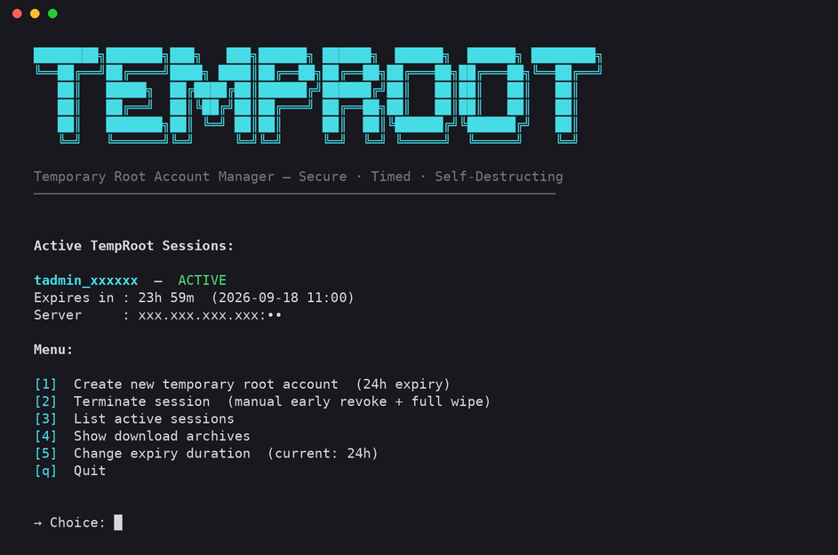
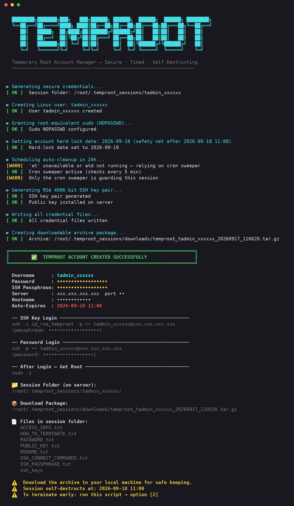

<div align="center">


**Temporary root access for Linux servers. Secure, timed, self-destructing.**


-E95420?logo=ubuntu&logoColor=white)


</div>

---

## 🧭 What it does

You run one command on a server. It creates a throwaway admin account, gives it passwordless
sudo, generates an SSH key pair, writes every credential into a tidy folder, and schedules
its own deletion. When the time's up the account, its home, its sudo rights, its keys and
its archives are all gone.

Handy when a contractor needs root for a day, when you're handing a box to a colleague for
a weekend, or when you want a login to hand out and forget about.

## ✨ Features

- 🔐 **32-character random password** and a **4096-bit RSA key** with its own passphrase
- ⏱️ **Timed expiry** from 1 hour up to 30 days (720h), default 24h
- 🧹 **Two-layer cleanup**: an `at` job for the exact minute, plus a cron sweeper every 5 minutes, surviving reboots and a stopped `atd`
- 🛡️ **Hard lock** via `chage -E` as a last-resort safety net
- 📦 **Download bundle**: `.tar.gz` (and password-protected `.zip` when `zip` is installed) with everything the recipient needs
- 📄 **Self-explaining docs** inside the bundle: how to connect, how to escalate, how to terminate early
- 🖥️ **Interactive menu** or plain CLI flags, your choice
- 🚫 **Refuses unsafe runs**: won't schedule itself from a non-root-owned or world-writable file, and won't purge anything besides a name it generated

## 🚀 Quick start

One line, download and run:

```bash
sudo curl -fsSL https://raw.githubusercontent.com/readypixels/temproot/main/temproot.sh -o /usr/local/sbin/temproot.sh && sudo chmod 755 /usr/local/sbin/temproot.sh && sudo bash /usr/local/sbin/temproot.sh
```

This drops the script where root owns it (the script refuses to schedule itself from
anywhere else), makes it executable, and opens the menu. Next time it's:

```bash
sudo temproot.sh            # menu
sudo temproot.sh --create   # straight to a new account
```

The script prints the credentials at the end and tells you where the archive landed.
Pull it down with:

```bash
scp root@SERVER:/root/.temproot_sessions/downloads/temproot_tadmin_xxxxxx_*.tar.gz .
```

### Prefer to read it first?

Fair. Piping a script straight into sudo bash means running something you haven't seen yet.
Do it in three steps instead:

```bash
curl -fsSL https://raw.githubusercontent.com/readypixels/temproot/main/temproot.sh -o temproot.sh
less temproot.sh
sudo install -m 755 -o root temproot.sh /usr/local/sbin/temproot.sh
sudo temproot.sh
```

Download it, read it, then move it to a root-owned path and run it. Same script, same
result, nothing runs before you've looked at it.


## 📸 What it looks like

The interactive menu, with one live session showing its countdown:



A full `--create` run, from key generation to the final summary:



## 🧾 Commands

| Flag | What it does |
| --- | --- |
| *(none)* | Interactive menu |
| `--create` | Create a new account right now with the current expiry |
| `--list` | Show active sessions and time remaining |
| `--downloads` | Show archive paths |
| `--purge <user>` | Terminate a session early and wipe everything |
| `--sweep` | Purge every expired session (this is what cron runs) |
| `--help` | Usage |

Change the expiry from the menu (option 5) before creating, or edit `EXPIRE_HOURS` at the
top of the script.

## ⏳ How expiry works

Three things guard each session, in this order:

1. **`at` job** at the exact expiry minute, if `atd` is installed and running.
2. **Cron sweeper** (`*/5 * * * *`) reading each session's `.meta` file and purging any
   whose expiry epoch has passed. It installs itself on first create and removes itself
   when no sessions remain. It works after a reboot and doesn't care whether `atd` exists.
3. **Account hard lock** (`chage -E`) set to the day *after* the intended expiry. This is
   a backstop only. `chage -E` takes a date and locks at midnight of this date, so setting
   it to the expiry date itself would cut a session short by up to 24 hours.

If you only see a warning saying "only the cron sweeper is guarding this session", it's
fine. It means `atd` isn't around. The sweeper alone is enough.

## 📁 What's in the bundle

```text
temproot_tadmin_xxxxxx/
├── README.txt                 quick overview
├── ACCESS_INFO.txt            master file: server, user, password, key, passphrase
├── PASSWORD.txt
├── SSH_PASSPHRASE.txt
├── SSH_CONNECT_COMMANDS.txt   copy-paste ssh / scp lines
├── PUBLIC_KEY.txt
├── HOW_TO_TERMINATE.txt
└── ssh_keys/
    ├── id_rsa_temproot        private key (encrypted with the passphrase)
    └── id_rsa_temproot.pub
```

## 🗑️ What gets wiped on purge

- Running processes owned by the user (`pkill -u`)
- The sudoers drop-in
- Membership of `sudo` / `wheel`
- The user and its home directory
- The `at` job and the cron sweeper line (once no sessions are left)
- The session folder under `/root/.temproot_sessions/`
- Every archive for the user under `downloads/`

## 🔒 Security

Read [SECURITY.md](SECURITY.md) before handing bundles to anyone. It says what the script
protects, what it deliberately leaves to you, and how to report a problem.

## 📖 Tutorial

[docs/tutorial.md](docs/tutorial.md) walks through every command with an annotated
screenshot per step, from install to purge. All thirteen shots are from a real run.

## 🧪 Testing

There's a WSL Ubuntu test loop written up in [CLAUDE.md](CLAUDE.md). Short version: copy
the script into `/tmp` inside WSL, chown it to root, create a 1-hour session, edit the
`.meta` expiry to the past, and watch the cron sweeper remove it at the next 5-minute mark.

## 📜 License

[MIT](LICENSE). Do what you like with it, don't blame me if you lock yourself out.

---

<div align="center">

**Made with ❤️ by [ReadyPixels](https://readypixels.com)**

🛠️ Built for sysadmins who'd rather hand out a key which expires than a password which doesn't.

⭐ If it saved you a late-night "did I delete the account?" moment, a star is welcome.

</div>
