# temproot, start to finish

This walkthrough takes you from a fresh copy of the script to a purged account, and it covers every command the script has. You'll install it, look at the menu and the help, change the default expiry, create an account, read what it printed, check the session, find the bundle, see what's inside, prove that sudo works, look at the cron job that guards the session, and then tear it all down. It takes about ten minutes on a server you already have root on.

Every screenshot below came from a real run on Ubuntu 24.04. Nothing was mocked up. Passwords, the key passphrase, the server address, the port and the hostname are masked in the pictures, and the generated username is shown as `tadmin_xxxxxx`. Yours will have six random letters and digits instead.

## Before you start

- A Linux server with `bash`, `useradd`, `chage`, `ssh-keygen` and `tar`. Any mainstream distro has them.
- Root on that server. The script refuses to run otherwise.
- `cron` running. `at` is optional, and the walkthrough below was done on a box without it, so you'll see what that looks like.

## 1. Put the script where root owns it

Copy `temproot.sh` into `/usr/local/sbin`, make root the owner, and set the mode to 755. Then list it to check.

```bash
cp temproot.sh /usr/local/sbin/ && chown root:root /usr/local/sbin/temproot.sh \
  && chmod 755 /usr/local/sbin/temproot.sh && ls -l /usr/local/sbin/temproot.sh
```

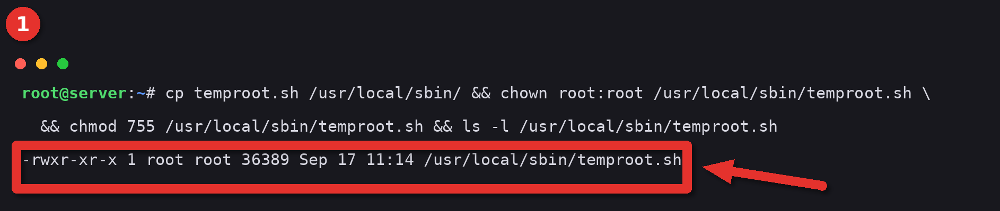

Look for `-rwxr-xr-x 1 root root` at the start of the listing line.

This isn't fussiness. The cron job you'll see in step 11 runs this exact file as root, on its own, hours later. If anyone else could edit the file in the meantime, they'd get root. So the script checks its own owner and mode before it schedules anything, and it refuses to create an account if the file is group or world writable or not owned by root. Running it straight out of `/tmp` or your home directory is the usual way to hit that refusal.

## 2. Read the help

Run it with `--help` to see every flag on one screen.

```bash
temproot.sh --help
```

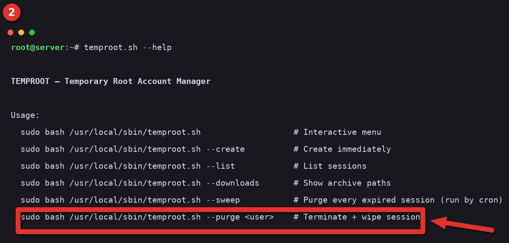

The line boxed in red is the one you'll use most after `--create`. Note that `--sweep` is listed too. You won't run it by hand, cron does, but it's there so you can if you ever need to.

## 3. Open the menu

Run the script with no arguments and you get the interactive menu. It starts with a list of live sessions, which is empty right now, then the options.

```bash
temproot.sh
```

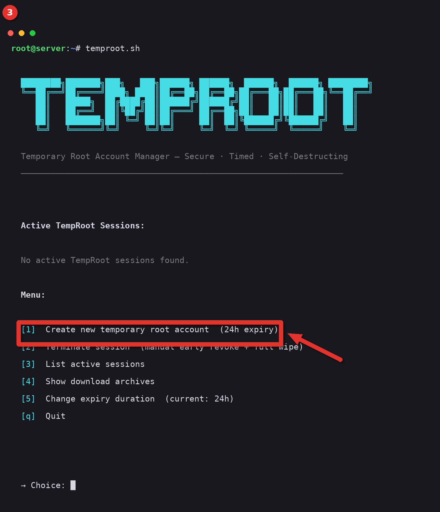

Option 1 is the same as `--create`, 2 is `--purge` with a confirmation prompt, 3 is `--list`, 4 is `--downloads`. Option 5 has no flag equivalent, which is why the next step is about it. Press `q` to leave.

## 4. Change the default expiry

The default is 24 hours. If you want a different length for the account you're about to make, pick option 5 and type the number of hours, anywhere from 1 to 720. This run set it to 48.

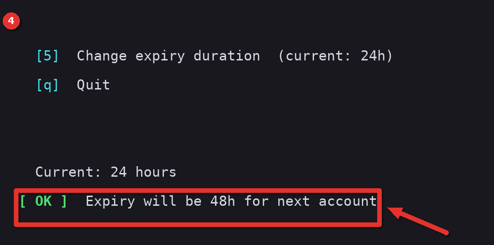

After the confirmation the menu redraws and option 1 now says `(48h expiry)`.

Two things catch people here. The change only lasts for this run of the menu, so if you quit and come back it's 24 again. And it doesn't touch accounts that already exist. To make a different default stick, edit `EXPIRE_HOURS=24` near the top of the script.

## 5. Create the account

Either pick option 1 in the menu or run the flag directly. This run used the flag with the default 24 hours.

```bash
temproot.sh --create
```

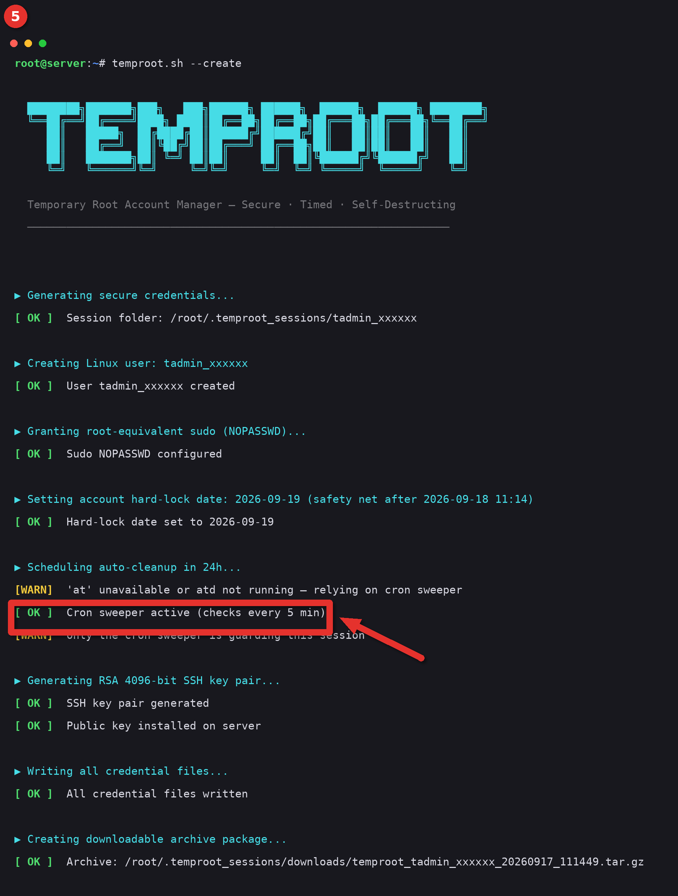

Read down the steps as they go by. The user is created, sudo is granted with `NOPASSWD`, a hard-lock date is set one day after the intended expiry, the cleanup is scheduled, the key pair is generated, the credential files are written, and the archive is packed.

The boxed line is the one to check. `Cron sweeper active` means a cron job now runs every five minutes and purges anything past its expiry. On this box there's a yellow warning above it, `'at' unavailable or atd not running`, because `at` isn't installed. That's fine. The sweeper alone is enough. When `at` is present you'll see a green line saying it was scheduled as well, and then you've got two guards instead of one.

The hard-lock date deserves a sentence. `chage -E` takes a date, not a time, and it locks the account at midnight on that date. If the script set it to the day the session expires, the account would lock up to 24 hours early. So it's set to the day after, as a backstop only. Exact-time removal is the sweeper's job.

## 6. Read the summary

The bottom of the same run is the part you'll copy from.

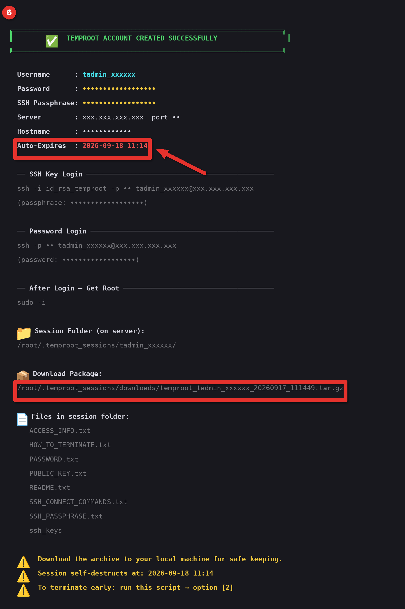

Everything the recipient needs is here. The username, the password, the SSH key passphrase, the server address and port, and the exact time the account self-destructs. Below that are ready-made `ssh` lines for key login and for password login, then `sudo -i` for a root shell.

The two boxes mark what you'll need later. `Auto-Expires` is the deadline. The `Download Package` path is the archive you hand over. The password and passphrase are shown in plain text on your terminal, so clear your scrollback if someone else can see the screen.

## 7. Check the session

`--list` shows every live session with its countdown.

```bash
temproot.sh --list
```

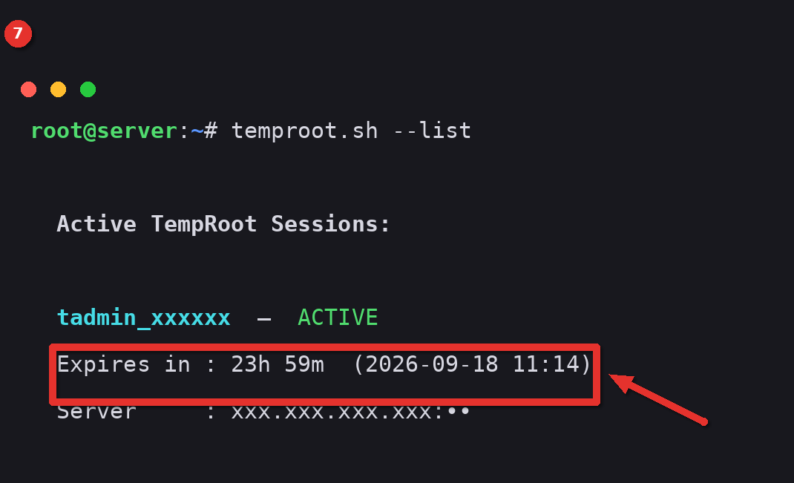

`Expires in : 23h 59m` counts down from the moment of creation. If you ever see a session marked EXPIRED in this list, the sweeper hasn't got to it yet, or cron isn't running. Step 11 shows how to check.

## 8. Find the archive

`--downloads` lists the archives waiting under `/root/.temproot_sessions/downloads/` and prints the `scp` line to fetch one.

```bash
temproot.sh --downloads
```

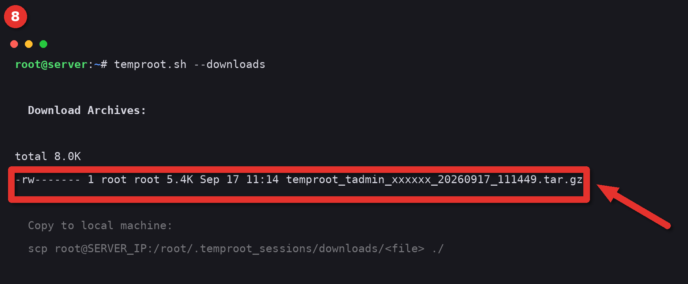

The archive is mode 600, so only root on the server can read it. Copy it down with `scp` from your own machine, then send it to the recipient over something encrypted. Not email. The archive is the secret. Whoever has it has root until expiry.

If `zip` is installed on the server you'll see a `.zip` beside the `.tar.gz`. It's the same contents with a password. Use the tar.

## 9. See what's inside

`tar -tzf` lists the contents without extracting.

```bash
tar -tzf /root/.temproot_sessions/downloads/temproot_tadmin_xxxxxx_*.tar.gz
```

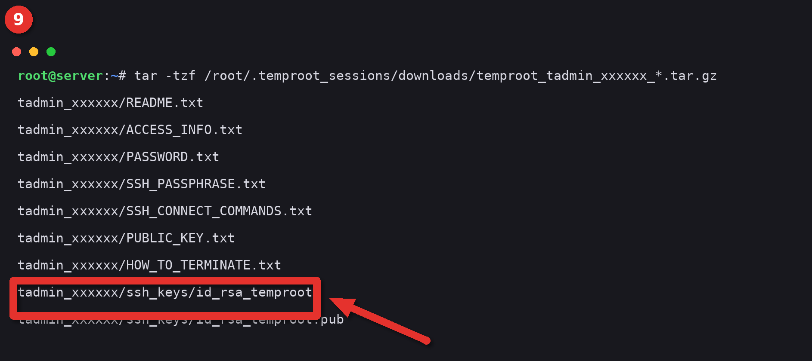

Nine files. `ACCESS_INFO.txt` is the master sheet with everything in one place. `SSH_CONNECT_COMMANDS.txt` has the copy-paste lines. `HOW_TO_TERMINATE.txt` tells the recipient how to end the session early. The boxed one, `ssh_keys/id_rsa_temproot`, is the private key, encrypted with the passphrase in `SSH_PASSPHRASE.txt`. The recipient needs to `chmod 600` it before `ssh` will accept it.

## 10. Prove that sudo works

Before you hand anything over, confirm the account can reach root. Switch to it and ask `sudo` for `id` without a password prompt.

```bash
su - tadmin_xxxxxx -c 'sudo -n id'
```

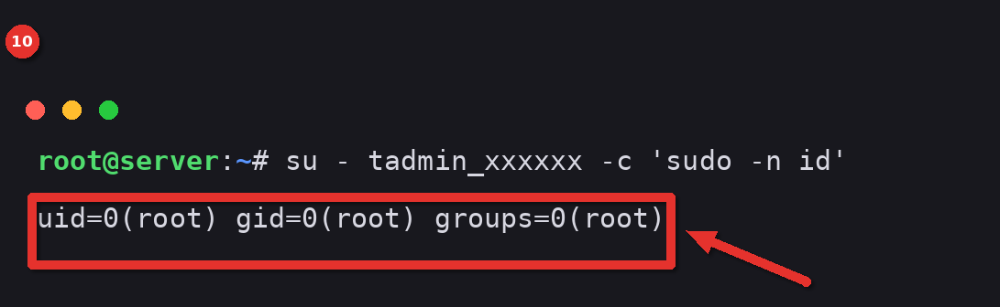

`uid=0(root)` is what you want. The `-n` flag makes `sudo` fail instead of prompting, so if `NOPASSWD` hadn't been set this would print an error rather than hang.

## 11. Look at the guard

The sweeper is one line in root's crontab.

```bash
crontab -l | grep TEMPROOT
```

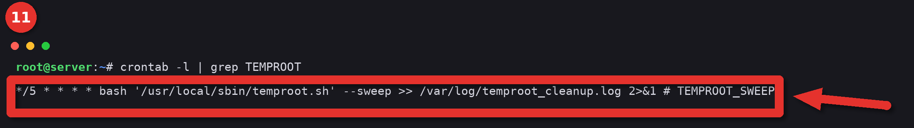

Every five minutes cron runs the script with `--sweep`. That reads each session's metadata, compares the stored expiry to the clock, and purges anything past it. It survives reboots, it doesn't care whether `at` exists, and it removes itself from the crontab once no sessions are left. Output goes to `/var/log/temproot_cleanup.log`, which is the first place to look if an account outlives its time.

The script exports a full `PATH` at the top before it does anything else. That's because cron runs with `PATH=/usr/bin:/bin`, and `userdel`, `chage` and `gpasswd` live in `/usr/sbin`. Without that export the sweep would run, find nothing, and report success. That exact bug is why this line exists in the script.

## 12. Terminate early

When the work's done, don't wait for the clock. Purge it.

```bash
temproot.sh --purge tadmin_xxxxxx
```

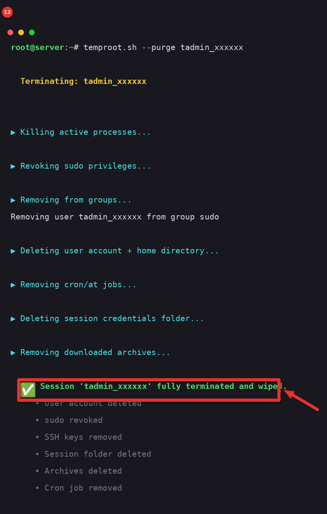

The steps go by in order. Processes killed, sudo revoked, group membership removed, user and home deleted, scheduler entries removed, session folder deleted, archives deleted. The boxed line at the end is the confirmation.

`--purge` only accepts names that match `tadmin_` plus six lowercase letters or digits. Hand it `root` or `..` and it refuses before touching anything. That guard was added after noticing what `rm -rf` on the session folder would have done with `..` as the name.

## 13. Confirm it's gone

Two checks. The list should be empty, and `id` should not know the user.

```bash
temproot.sh --list && id tadmin_xxxxxx
```

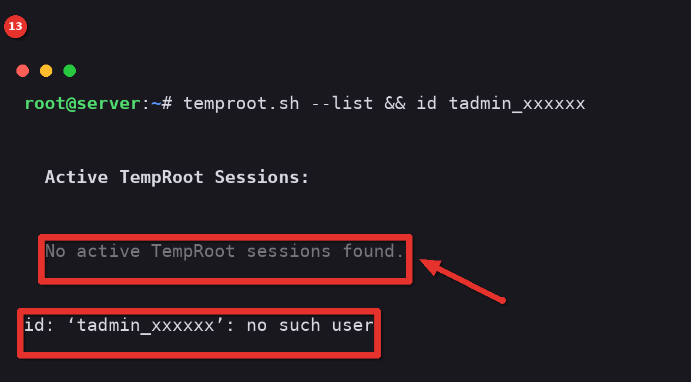

If `id` still finds the user after a purge, something is holding it. Usually a process that `pkill` didn't catch in its one-second window. Run the purge again.

## What you have now

A root-owned copy of the script in `/usr/local/sbin`, no leftover accounts, and a clean crontab. The next account you create will go through the same steps, and the sweeper will reinstall itself for as long as it's needed.

One thing left for you to decide. The archive ships the private key together with its passphrase and the password. That's convenient for the recipient and it means the archive alone is enough to get root. If that bothers you, send the passphrase and password over a separate channel and strip them from the bundle before you send it. [SECURITY.md](../SECURITY.md) has more on that.
